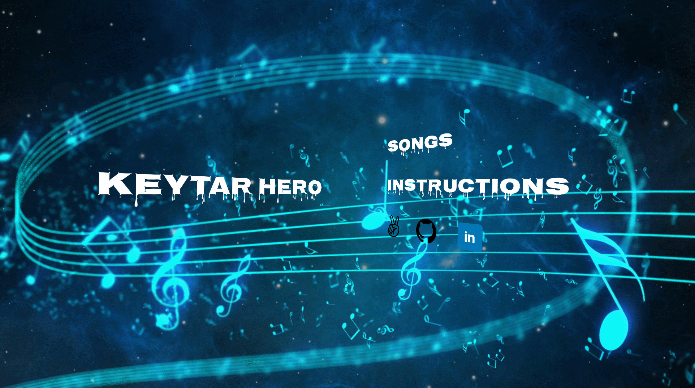
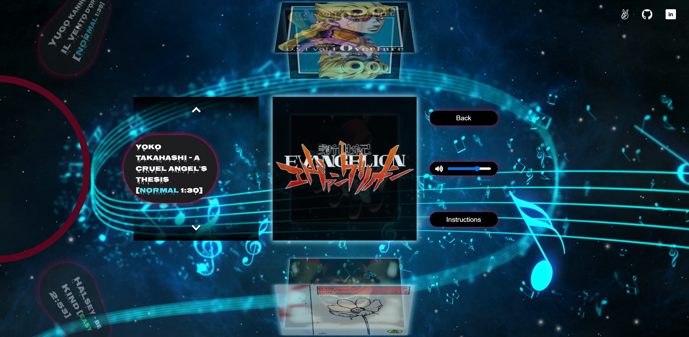
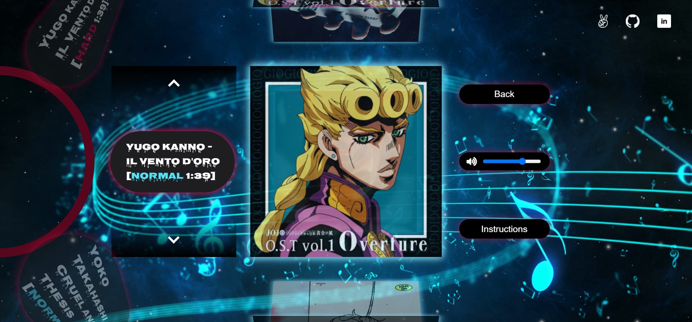

# Keytar Hero
[Live](https://linkedlists.github.io/Keytar-Hero/)

## Description

Keytar Hero is a Javascript and HTML Canvas music and rhythm game that is inspired by Guitar Hero. Players play through a song by timing the correct keypresses for each note at the right time.

## Features
* Instructions modal
* Option to mute or change the volume of the song
* Play the game by timing notes that correspond to a keypress.

## Gameplay

## Future Features
* Increased score variations depending on the player's accuracy
